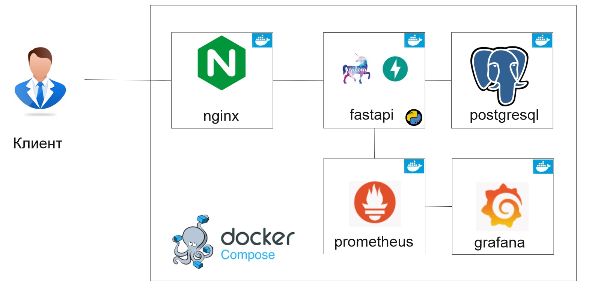

<div style="text-align: center;">


# Приложение "клон Twitter"
</div>

###  Описание приложения.
Для корпоративного сервиса микроблогов реализован бэкенд
приложения на ***веб-фреймворке FastApi***. Поскольку это корпоративная сеть, то функционал будет урезан
относительно оригинала. 

Сервис уметь делать:
1. Пользователь может добавить новый твит.
2. Пользователь может удалить свой твит.
3. Пользователь может зафоловить другого пользователя.
4. Пользователь может отписаться от другого пользователя.
5. Пользователь может отмечать твит как понравившийся.
6. Пользователь может убрать отметку «Нравится».
7. Пользователь может получить ленту из твитов отсортированных в
порядке убывания по популярности от пользователей, которых он
фоловит.
8. Твит может содержать картинку.

База данных: использует ***базу данных PostgreSQL***. Храните в ней
информацию о твитах, пользователях, лайках, фоловерах и медиа.
---
###  Запуск.
Систему просто развернуть через Docker Compose. Запуск приложения происходить по командам:
```
docker-compose build
docker-compose up -d
```
---

###  Тестирование.
Приложение покрыто на 51% unit-тестами и проверено линтерами (black, isort, flake8, mypy).
Тесты запускаются в терминале 
```
pytest app/tests/
```
---

###  Swagger.
Все ответы сервиса задокументированы через Swagger.

http://localhost:8000/docs

---

### Архитектурное решение:
Приложение разворачивается с помощью Docker-compose. Docker поднимает 5 контейнеров: postgresql, fastapi, nginx, prometheus, grafana

|     № контейнера | название    | реализация                                                   |  открытые порты |
|-----------------:|:------------|:-------------------------------------------------------------|----------------:|
|                1 | postgresql  | база данных: ***PostgreSQL***                                |            5433 |
|                2 | fastapi     | backend  реализован на ***веб-фреймворке FastApi***          |            8000 |
|                3 | nginx       | веб-сервер ***nginx***                                       |              80 |  
|                4 | prometheus  | сборщик статистики ***prometheus***                          |            9090 |
|                5 | grafana     | визуализатор статистики ***grafana***                        |            3000 |

После запуска всех контейнеров, переходим в браузере по адресу "localhost". При переходе по данному адресу nginx отображает статичную страницу. После нажатия кнопок, nginx передаёт запросы в fastapi. Fastapi обрабатывает запрос, связывается с базой данных postgresql и выдаёт в ответ json-объект для nginx.
Так же prometheus каждые 5 секунд запрашивает статистику у fastapi. При переходе по адресу localhost:3000 откроется grafana (логин: admin, пароль: admin) и котором можно настроить удобное отображение статистических данных по работе приложения.

### 
